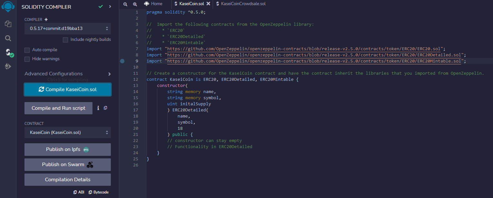
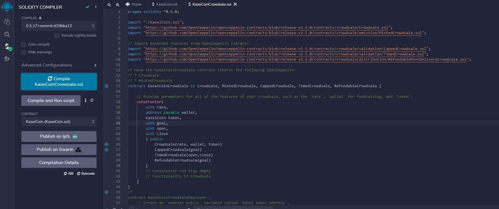
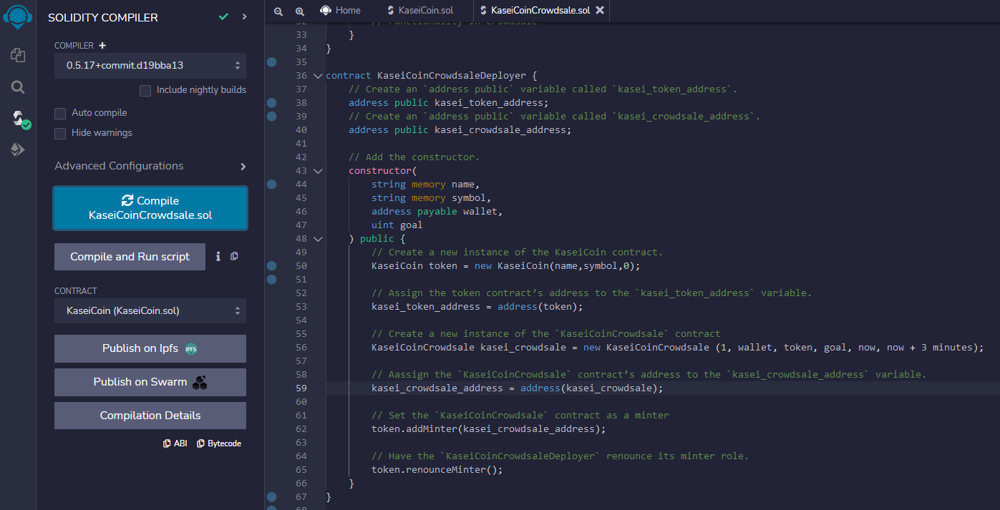

### KaseiCoin.sol compile screenshot

### KaseiCoinCrowdsale.sol (no deployer) compile screenshot

### KaseiCoinCrowdsale.sol (with deployer) compile screenshot

### Functionality Preview (Note: Capped, Timed, and Refundable)
Activities in GIFs
1. Deploy the crowdsale to a local blockchain by using Remix, MetaMask, and Ganache.

2. Test the functionality of the crowdsale by using test accounts to buy new tokens and then checking the balances of those accounts.

3. Review the total supply of minted tokens and the amount of wei that the crowdsale contract has raised.

4. Send ether to the crowdsale from a different account (that is, not the same account that’s raising funds). Then, once you confirm that the crowdsale works as expected, try to add the token to your wallet and to test a transaction.

5. By setting the `close` time to a shorter crowdsale show the crowdsale expiring and refunding.

6. When sending ether to the contract, make sure that you meet the `goal` of the contract. Then finalize the sale by using the `finalize` function of the `Crowdsale` contract. Note that to finalize the sale, `isOpen` must return false (`isOpen` comes from `TimedCrowdsale` and checks whether the `close` time has passed). If you set the `goal` to 300 ether, for example, you might need to have multiple accounts buy tokens to meet the goal. If you run out of prefunded accounts in Ganache, you can create a new workspace.

7. Review your tokens in MetaMask. To do so in MetaMask, click Add Token, click Custom Token, and then enter the address of the token contract. Make sure to buy larger amounts of tokens to get the denomination to appear in your wallet as more than a few wei worth.